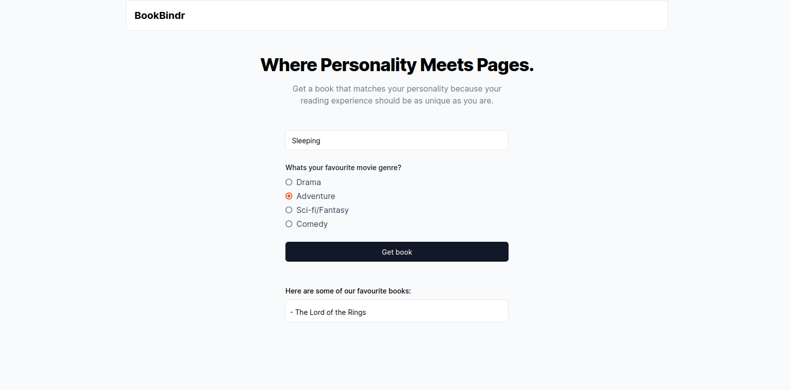

# BookBindr

This app recommends books based on a user's preferred book genre.

Check out live demo [here](https://book-bindr.vercel.app)


## Data Structures

**Genres**

```
[{
  name: "Drama",
  score: 80
},
{
  name: "Adventure",
  score: 95
}]
```
Each genre has a  ``name`` and ``score``

**Books**

Books

```
[{
title: "To Kill a Mockingbird",
       link: "https://en.wikipedia.org/...",
       scores: [95, 80, 60, 70]
},
{
title: "The Hitchhiker's Guide ...",
       link: "https://en.wikipedia.org/...",
       scores: [60, 90, 80, 95]
}]

```

Each book has a ``title``, ``link``, and ``scores`` array matching up with the genres array.

## Algorithm

The recommendation algorithm works as follows:

1. Get user's single preferred genre name from frontend (e.g. "Drama")
2. Lookup preferred genre's score in genres array
3. Construct user preferences array with preferred genre's score
4. Fill remaining array entries with 0s
5. Calculate vector difference between user preferences array and each book's genre score array
6. Return closest matching book

Example: if user prefers "Drama":

```
1. User prefers "Drama"
2. Drama score is 80
3. User prefs = [80, 0, 0, 0]
4. Calculate difference between [80, 0, 0, 0] and book genre scores
5. Return closest matching book
```

This allows matching with just a single preferred genre from the user.
